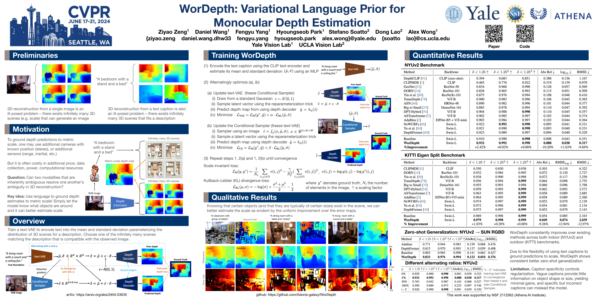

# WorDepth: Variational Language Prior for Monocular Depth Estimation #

Official implementation of the paper "WorDepth: Variational Language Prior for Monocular Depth Estimation"

_**Accepted by CVPR 2024**_

Paper Link: https://arxiv.org/abs/2404.03635

Presentation Video (5min): https://www.youtube.com/watch?v=QNwOFZZc8XI

Authors: Ziyao Zeng, Daniel Wang, Fengyu Yang, Hyoungseob Park, Yangchao Wu, Stefano Soatto, Byung-Woo Hong, Dong Lao, Alex Wong

## Overview ##
3D reconstruction from a single image is an ill-posed problem because infinitely many 3D scenes with different scales can generate the same image. For instance, a small toy car placed closer or a large car placed further away can appear identical in the same image due to projection.

Similarly, 3D reconstruction from a text caption is also an ill-posed problem. Infinite 3D scenes can fit a given description. For example, in "a bedroom with a stand and a bed," the stand and bed can be positioned anywhere within the room.

This raises the question: Can two inherently ambiguous modalities, single images and text captions, resolve each other's ambiguity in 3D reconstruction?

When people are informed "this is a toy car," they immediately gain prior knowledge about the object's size. Combined with observations, this knowledge can help narrow down the solution space for depth estimation. Our key idea is to use language as a variational prior to ground depth into a metric scale.


### Pipeline ###
We train a text-VAE to encode text into the mean and standard deviation parameterizing the distribution of 3D scenes for a description.

For one text caption, we encode the mean and standard deviation, then sample a feature from the Gaussian with such mean and standard deviation to generate a depth map that aligned with such a description.

Then, in inference, we choose one of the infinitely many scenes matching the description that is compatible with the observed image using a Conditional Sampler. We do so by predict epsilon tilt in the reparameterizaion step instead of sampling it from a standard Gaussian. And we alternatively optimize the text-VAE and the Conditional Sampler with a ratio *p*.


### Visualization on NYU-Depth-v2 ###
Knowing that certain objects and that they are typically of certain sizes exist in the scene, we can better estimate the scale as evident by the uniform improvement over the error maps.


### Poster ###

## Setup Environment ##
Create Virtual Environment:
```
virtualenv -p /usr/bin/python3.8 ~/venvs/wordepth

vim  ~/.bash_profile
```
Insert the following line to vim:
```
alias wordepth="export CUDA_HOME=/usr/local/cuda-11.1 && source ~/venvs/wordepth/bin/activate"
```
Then activate it, install all packages:
```
source ~/.bash_profile

wordepth

pip install -r requirements.txt
```

Download Swin-L checkpoint
```
wget https://github.com/SwinTransformer/storage/releases/download/v1.0.0/swin_large_patch4_window12_384_22k.pth
```

For simplicity, we have extracted image caption using [ExpansionNet v2](https://github.com/jchenghu/ExpansionNet_v2) in "./text" and extracted their CLIP text features in "./text_feat". While running, the model will automatically load text features.

## Setup Datasets ##
### Prepare Datasets ###
Download [NYU-Depth-v2](https://cs.nyu.edu/~fergus/datasets/nyu_depth_v2.html) and [KITTI](https://www.cvlibs.net/datasets/kitti/). Or you can refer to [KBNet](https://github.com/alexklwong/calibrated-backprojection-network) to prepare datasets through the provided download scripts.

Then change the data_path and gt_path in configs.

The structure of dataset should look like this:

    ├── nyu_depth_v2
    │   ├── official_splits             # path to nyu-depth-v2 data_path_eval and gt_path_eval
    │   │   ├── test
    │   │   │   ├── bathroom
    │   │   │   │   ├── rgb_00045.jpg
    │   │   │   │   ├── rgb_00046.jpg
    │   │   │   │   ├── ...
    │   │   ├── train                    # We don't use this part
    │   │   │   ├── ...
    │   ├── sync                           # path to nyu-depth-v2 data_path and gt_path
    │   │   ├── basement_0001a
    │   │   │   ├── rgb_00000.jpg
    │   │   │   ├── rgb_00001.jpg
    │   │   │   ├── ...
    └── ...

    ├── kitti_raw_data                     # path to kitti data_path and data_path_eval
    │   ├── 2011_09_26                     # name of dataset
    │   │   ├── 2011_09_26_drive_0001_sync
    │   │   │   ├── ...
    └── ...


    ├── kitti_ground_truth                 # path to kitti gt_path and gt_path_eval
    │   ├── 2011_09_26_drive_0001_sync
    │   │   ├── ...
    └── ...


### Train NYU-Depth-v2 or KITTI ###
Specify GPU Number run_kitti.sh or run_nyu.sh, then run by:
```
sh run_kitti.sh
```
or
```
sh run_nyu.sh
```
Before running new experiments, if you change the model_name, remember to maintain the model_name in train_nyu.sh and config/arguments_train_nyu.txt to be the same.

### Eval NYU-Depth-v2 or KITTI ###
After our paper was accepted, we discovered that by removing the skip connections in the U-Net architecture and setting alternating probablity to 0.5, the model achieved better prior depth map generation while maintaining comparable performance in Monocular Depth Estimation. The underlying intuition is that removing the skip connections forces the model to extract all essential image features within the latent space. Consequently, by alternatively sampling latent features from a Gaussian distribution, we can better enforce the prior in the latent space for the final depth prediction. We have provided both our lagacy model, as described in the paper, and our latest models trained without skip connections.

[Model Checkpoints](https://yaleedu-my.sharepoint.com/:f:/g/personal/ziyao_zeng_yale_edu/Ekk9W3E1q7xBs6KwQcsnpa0B9Ac0QuhklMKa-PURucvwYg?e=ScKwas)

Add those flag to the arguments before running to do evaluation:
```
--eval_only
--checkpoint_path "path to the checkpoints"
```
if you are evaluating lagacy checkpoints, you need also add:
```
--lagacy
```
to enable the skip-connection in the U-Net.

## Acknowledgements ##
We would like to acknowledge the use of code snippets from various open-source libraries and contributions from the online coding community, which have been invaluable in the development of this project. Specifically, we would like to thank the authors and maintainers of the following resources:

[CLIP](https://github.com/openai/CLIP)

[Swin Transformer](https://github.com/microsoft/Swin-Transformer)

[ExpansionNet v2](https://github.com/jchenghu/ExpansionNet_v2)

[VA-DepthNet](https://github.com/cnexah/VA-DepthNet)

[KBNet](https://github.com/alexklwong/calibrated-backprojection-network)
